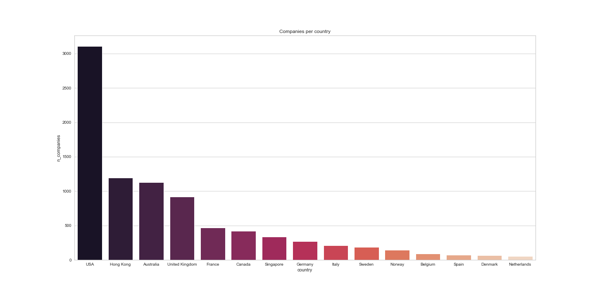
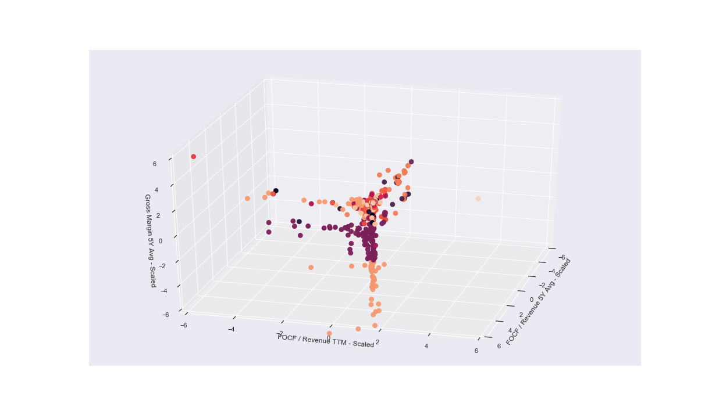
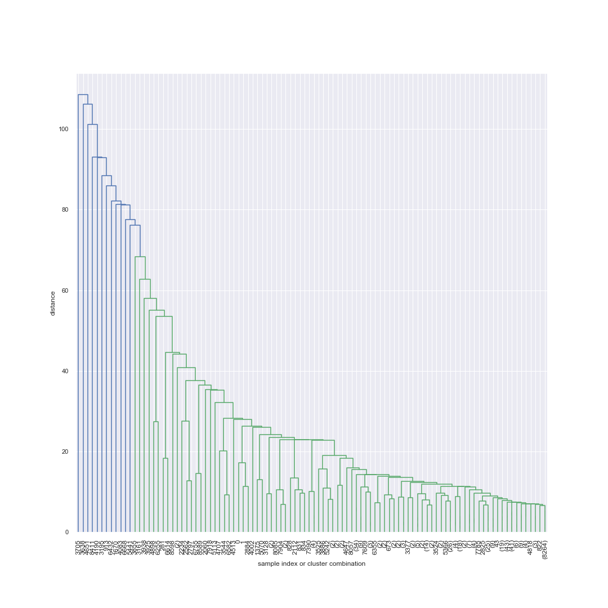
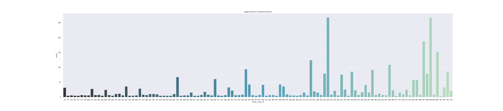

IN Progress

# Investment-Overwatch

“My life seemed to be a series of events and accidents. Yet when I look back I see
a pattern.” - Benoit Mandelbrot

## Project Premise 

The goal of this project is to screen global publicly traded companies using unsupervised machine learning.

    - Number of companies: approximately 8,500 
    - Markets include: USA, Australia, Germany, France, Canada, United Kingdom, Norway, Sweden, Denmark, Singapore, Netherlands, Hong Kong, Spain, Italy, Belgium
    - Sectors include: Autos, Mining, Biotech, Healthcare, Consumer goods, Financial Service, Energy etc.

Clustering algorithms are primarily used in this project for segmentation of global stocks into potential study groups to complement fundamental company anlaysis. Our aim is to identify investment opportunities by observing clusters of companies with unique financial features and systematize the company screening process for an investment company.

## Project Structure

Three main notebooks for collection, preprocessing and modelling of data. The main notebook contains a extended altered version of all three notebooks. 

Folders: 

    - visualizations: contains some of graphs and images used to display the work
    - api_data: contains data from API 
    - metric_description: description of the financial features from Finnhub's API documentation
    - archived: files deleted in the course of the project
    
Main Repo Files: 

    - data_collection.ipynb: Contains examples of API loops to collect financial metrics of companies + additional finnhub features (company news, CEO compensation etc.) 
    - data_preprocessing.ipynb: Conatains data cleaning, imputation and initial observations -> output of this is 'clean_data.csv'
    - analysis_modelling.ipynb: Contains PCA and Clustering algorithms to group companies according to multiple financial dimensions

## Data Sources

The primary source of data is Finnhub, a free platform where you can access a wide range of financial data through their API. Data structure is accessible at a ticker/symbol level. One symbol corresponds to one company. To access data for mulitple companies we require to loop through a list of symbols and stay within the API call limits. We use a list of tickers from Yahoo Finance saved in the ticker_data folder. 

For more insights on Finnhub, here is an introductory blog: 

    - https://medium.com/@augustin.goudet/introduction-to-finnhub-97c2117dd9a9

## Data Description

We use companies as observations and company financial metrics as features. Initially, we used 89 features and scaled down to simplify the dataframe dimensionality. This was done to permit for intra-cluster inspection which would have been compromised with 89 features. 

We are using 27 financial features, stated below. We maintain optionality of future feature selection for the project's future state. The features below provide a view of each company's profitability, margin, leverage and valuation. Grouping companies according to these metrics will enable us analyze the clusters and companies as potential investment opportunities. 

    - Capital Spending growth rate 5 year
    - Current EV/Free Cash Flow (Annual)
    - Dividend Growth Rate (5Y)
    - Dividend Yield (5Y)
    - Dividend Yield
    - Free Operating Cash Flow CAGR (5Y)
    - Free Cash Flow (Annual)
    - Free Operating Cash Flow/Revenue (5Y)
    - Free Operating Cash Flow/Revenue (TTM)
    - Gross Margin (5Y)
    - Gross Margin (Annual)
    - Inventory Turnover (Annual)
    - Long Term Debt/Equity (Annual)
    - Net Debt (Annual)
    - Net Income/Employee (Annual)
    - Net Interest coverage (Annual)
    - Net Profit Margin % (Annual)
    - Net Profit Margin (5Y)
    - Payout Ratio (Annual)
    - P/E Normalized (Annual)
    - Price to Free Cash Flow (Per Share Annual)
    - Quick Ratio (Annual)
    - Receivables Turnover (Annual)
    - Revenue/Employee (Annual)
    - Revenue Growth Rate (5Y) 
    - Total Debt/Total Equity (Annual)
    - Total Debt CAGR (5Y)

## Preprocessing and EDA

We selected companies from several countries where the most data for the features above was available. 

We decided to use KNN imputation for missing values after testing several imputation method such as iterative imputer with a linearRegression and Random Forests methods. KNN uses a probabilistic approach to determine the most likely value of a missing parameter. Effectively, we interpret KNN imputation as a 'pre-clustering' approach. This approach has been validated to work well on large datasets. 

Four of our features are in local currency (e.g. EUR, DKK, HKD). We perform a conversion to USD in the preprocessing using python's Forex package. 

After preprocessing we observe the following correlation among our features (subset displayed below). 

## Modelling - PCA / KMeans Clustering / Agglomerative Clustering

### PCA

We begin by using PCA to identify potential simplification with less dimensions of our dataset that preserve the variance and decrease computation cost. We acknowledge that this may also impede us from diving into the features of the clusters. 
    
    - 23 features preserve 98% of the variance of our dataset / Limited effect of PCA

### KMeans(Km)

We initially ran KMeans on a wider dataset with 89 features -> narrowed to main dataset with 27 features as KMeans lead to complexity in extracting insights on clusters. 

We run two sets of KMeans clustering - with and without PCA data. 

As preliminary check for the optimal number of clusters to select we use the elbow method (non-PCA data example) calculating the sum of squared distances berween data point and centroid clusters, effectively the 'cost function' of KMeans.

    - 34 clusters is optimal point under this method / we elect 100 clusters to preserve company specific observation capabilities

We end up with a 100 clusters containing tens to thousands of companies. Clustering using Km does well to identify outliers which we notice in the clusters, but limits the interpretation possibilities of each cluster.

    - We can assess how the clusters appear across features. 

### Agglomerative Clustering (AGNES)

Secondary modelling method used. AGNES clustering makes less assumptions than KMeans and allows us to have more visibility into the number of cluster threshold selection (at the expense of being more computationally expensive). The Dendgrogram displays the clustering sequence. 

Dendogram truncation based on average Euclidian distance to select the number of clusters. 

    - Unique Clusters:  761
    - Company per cluster metrics:
        - cluster distance of 2 yields --> median: 1.0 ; mean: 11.362680683311432 ; min: 1 ; max: 4537

Display of resultsing clusters and number of companies within each:

## Project Evaluation / Conclusions

cl52 - km 

cl621 - agg

## Limitations Encountered

Dimensionality 

KMeans outliers

Data collection

## Future Work

### Sequential Clustering 

We believe using the same financial metrics in sequence to narrow down the number of companies and identify clusters should allows us to pinpoint specific companies as good investment candidates. 

An example would be take Enterprise Value / Free Cash flow and select the best 'valuation' clusters and then run an additional feature on the group of companies within those clusters. This iterative process will be the next step of this project.

### Data Iteration 

Simplifying the dataset we use and starting with a smaller set of companies and features should gives more agility to observe patterns across clusters. 

## References 

https://pdfs.semanticscholar.org/6db3/08779954a4006d87ce68148ff2aaa176dfb2.pdf

https://finnhub.io/

https://uk.finance.yahoo.com/most-active

